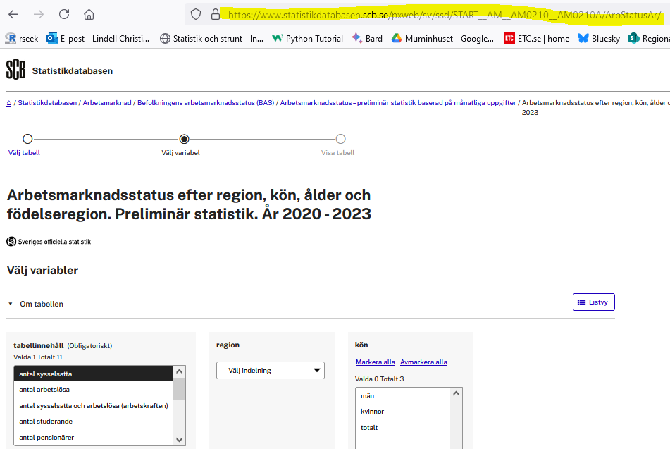
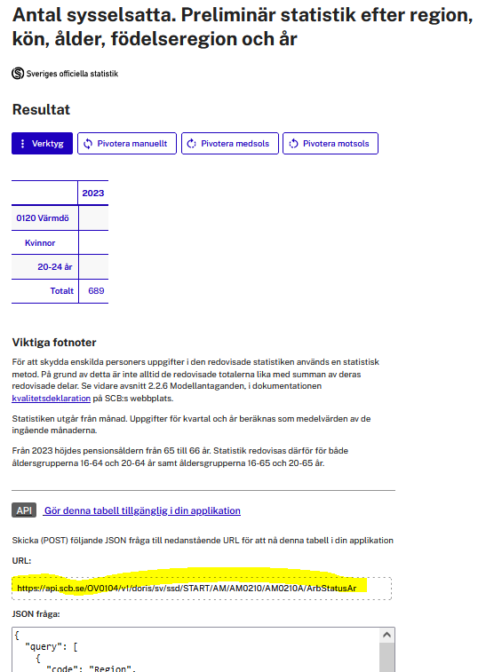
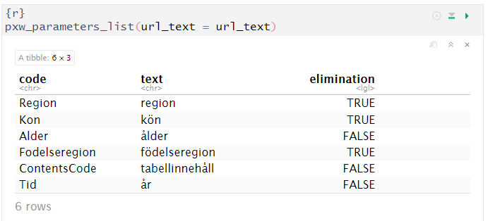
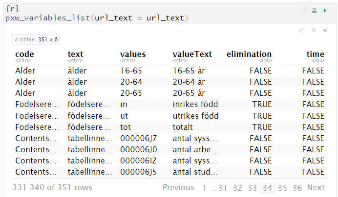
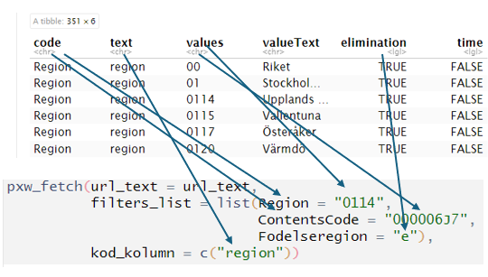
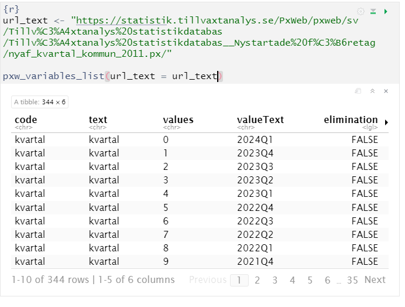
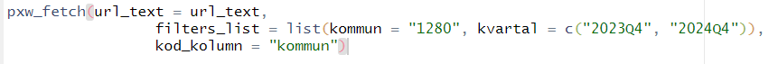
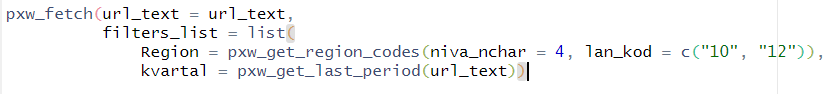

```{r, include = FALSE}
knitr::opts_chunk$set(
  collapse = TRUE,
  eval = FALSE,
  comment = "#>"
)
```

```{r setup}
library(fetchpxw)
```


## Inledning

Många myndigheter använder pxweb för att tillgängliggöra statistik. Pxweb är en databaslösning och ett protokoll som utvecklas av ett antal nationella statistikbyråer. För att hämta ut data behöver man kunna göra api-anrop. För att underlätta användandet av API:et finns ett utmärkt paket som heter [pxweb](https://cran.r-project.org/web/packages/pxweb/index.html). fetchpxw är en serie funktioner som använder sig av pxweb-paketet och är gjort för att underlätta nedladdning av statistik från främst svenska pxwebdatabaser.

## Ladda hem statistik från SCB

Pxweb erbjuder några enkla lösningar för att ladda hem statistik.Det enklaste sättet att ladda ner en tabell är att gå in i SCB:s statistikdatabas och gå till sidan där man väljer vilka variabler man vill ladda ned. På den sidan kopierar man webbadressen:



Lagra URL:en i variabeln url_text och använd den som argument till pwx_fetch.

```{r}
library(fetchpxw)

url_text <- "https://www.statistikdatabasen.scb.se/pxweb/sv/ssd/START__AM__AM0210__AM0210A/ArbStatusAr/"

df <- fetchpxw::pxw_fetch(url_text = url_text)
```

fetchpxw gör om URL:en till tabellsidan till en API-URL och hämtar hem samtliga dimensioner och variabler i tabellen. Detta fungerar utmärkt om det är små tabeller, men den valda tabellen är stor och måste hämtas hem i 15 omgångar.

Man kan därför välja att använda filter, vilka anges i parametern `filters_list` .

```{r}
df <- fetchpxw::pxw_fetch(
  url_text = url_text,
  filters_list = list(Alder = "20-64", Region = "1280")
)
```

Nu har vi filtrerat ut de som är i åldern 20-64 år och bor i Malmö, vilket blir en behändig dataframe på 36 rader.

Om konverteringen av adressen till tabellens webbsida inte fungerar kan man prova att istället använda adressen till tabellens API. Ange några värden i tabellen så att du kommer till resultatsidan. Där kan man välja att se koden som behövs för att anropa API:et och där kan man kopiera adressen till API:et:

{width="458"}

Men hur vet vi vilka parametrar och variabler tabellen innehåller? För att ta reda på det finns det en hjälpfunktion som heter `pwx_parameters_list`.

{width="577"}

Vill man se även vilka värden som varje variabel kan anta finns en funktion som visar både parametrar och variabler - `pxw_variables_list`:

{width="554"}

Men hur hänger parametrar och variabler ihop med argumenten i pxw_fetch? Detta framgår av bilden nedan:



Som synes har vissa variabler elimination = TRUE. Det innebär att variabeln kan tas bort. Detta anges med att variabeln får värdet "e".

När vi hämtar hem tabellen är alla värden i klartext, men ibland vill man även ha koder. Om man till exempel laddar hem antal invånare i alla Sveriges kommuner vill man inte bara har kommunnamnen utan ofta även en kolumn med kommunkoder. Detta får man genom att ange variabeln kod_kolumn lika med "region" (det går att skicka in en vektor med flera olika variabler som man vill ha koder till.

## Att anropa felkonfigurerade databaser (Tillväxtanalys och Jordbruksverket)

Tyvärr är det inte alla pxwebdatabaser som följer SCB:s standard. Tillväxtanalys och Jordbruksverket sparar variabelnamnen i *valueText* och *values* innehåller istället löpnummer. Det innebär att databasen till exempel inte kan ta en kommunkod som värde utan man måste veta vilket löpnummer som myndigheten tilldelat kommunen. Samma sak med tidpunkter - det går inte skicka in "2024Q1" till api:et, utan man måste veta att Tillväxtanalys tilldelat "2024Q1" löpnumret "0".

{width="542"}

Som synes är databasstrukturen ganska egendomlig. *code* och *text* innehåller till exempel samma värden. Kvartalen är sparade i *valueText* och anropas istället via ett löpnummer i *values*. Även i andra detaljer är databasen konstig. Värden i *code* kan till exempel innehålla å, ä och ö, vilket kan ställa till problem med teckenkodningen, värdet i kolumnen *time* (som inte fått plats i tabellen ovan) borde varit satt till TRUE för kvartalsvärdena för att kunna filtrera ut vilken variabel som innehåller tidsangivelse, men den är genomgående satt till FALSE. När kommuner finns med redovisas inte kommunkoden i *values*, utan både kommunkod och kommunnamn redovisas i samma textsträng i *valueText*, medan *values* innehåller ett löpnummer. Malmö heter alltså "1280 Malmö".

*Så kan vi inte ha det!* Vi måste kunna anropa pxweb med kommunnummer och årtal och inte behöva ange löpnummer istället.

pxw_fetch är skrivit för att kunna använda koder och inte löpnummer i anropen, vilket innebär att vi hämtar variabelnamen från *code*, medan de olika värden de kan anta hämtas från *valueText*. Kommuner och län har fått en handpåläggning så att man inte behöver skriva "1280 Malmö" utan att det räcker med att ange kommunkod eller länskod.

Ett anrop till Tillväxtanalys pxweb-databas kan se ut så här:



Namnen på variablerna kommer från *code*, medan värdena de kan anta kommer från *valueText*. Samma sak gäller för Jordbruksverket.

## Hjälpfunktioner för tid och regionkoder

Fetchpxw innehåller ett antal hjälpfuntioner för att sålla ut kommun- och regionkoder och vilka mättidpunkter som det finns data för.

Dessa funktioner är:

`pxw_get_first_period`(url_text): returnerar första året (eller kvartal etc) som det finns data för.

`pxw_get_last_period`(url_text): returnerar senaste året (eller kvartal etc) som det finns data för.

`pxw_get_periods`(url_text): returnerar alla år (eller kvartal etc) som det finns data för.

`pxw_get_period_intervall`(url_text, from_per, to_per): returnera alla värden från tiden angiven i *from_per* till och med tiden i *to_per*.

`pxw_get_region_codes`(url_text, niva_nchar = NULL, lan_kod = NULL): returnerar alla kommun- och regionkoder som finns i tabellen. niva_char anger hur många tecken koden ska bestå av. Om den är lika med 4 returneras endast kommunkoder, vilka består av fyra siffror. Om den är lika med 2 returneras länskoder, vilka består av två siffror. lan_kod bestämmer vilka län som ska filtreras fram. `pxw_get_region_codes`(url_text, niva_nchar = 4, lan_kod = c("10", "12")) returnerar kommunkoder för alla kommuner som finns i Blekinge ("10") och Skåne ("12").

Funktionerna kan användas inne i `pxw_fetch`. Vill man ha värden för senaste tidpunkt för alla kommuner i Skåne och Blekinge kan man till exempel skriva:


